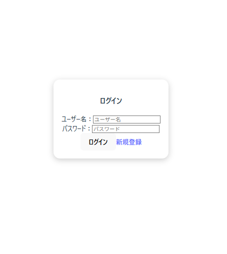
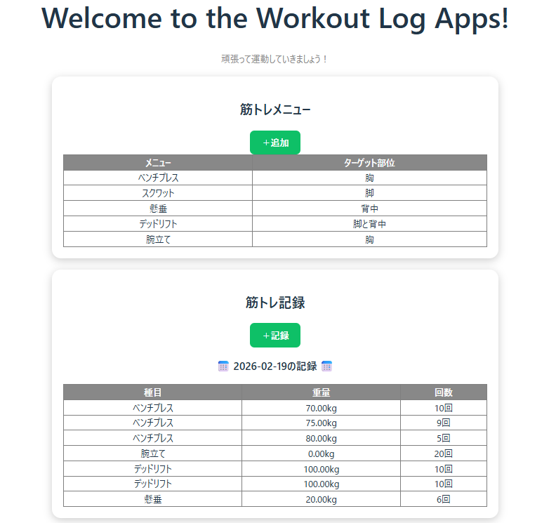
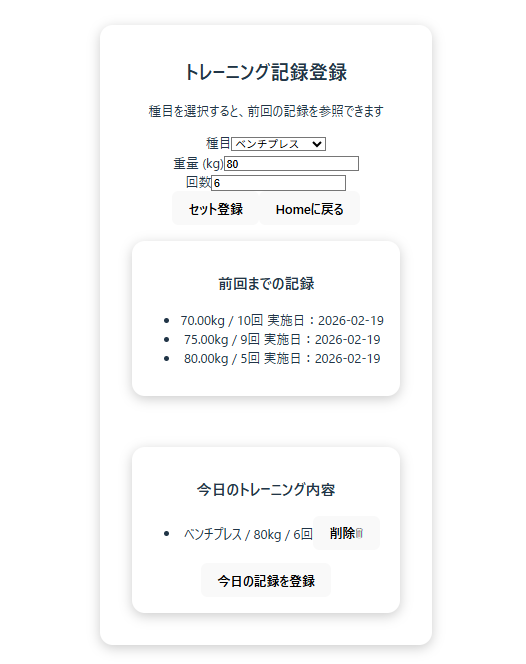
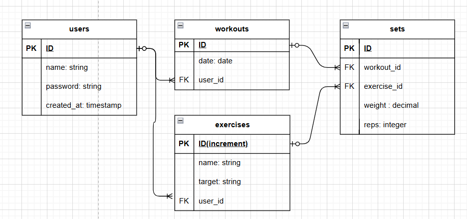

# 💪 workout-log

シンプルかつ使い勝手の良い、筋トレ記録アプリ。  
前回のトレーニング記録を簡単に参照でき、継続的な強度アップをサポート。  
種目は自由にカスタマイズ可能です。

---

## １．アプリの特徴・機能

- 🏋️‍♂️ 筋トレ種目の登録・管理
- 📅 ワークアウト記録
- 🔁 前回記録の参照
- 📈 徐々に負荷を上げるトレーニング支援
- 👤 ユーザー登録 / ログイン

---

## ２．使用技術一覧

### Backend


### Frontend


### Deploy


---

## ３．🚀 セットアップ(開発環境)

### 1.必要パッケージのインストール

プロジェクトルートディレクトリからコマンドの入力を開始してください。

```bash

# BE側のパッケージインストール

npm install

# FE側のパッケージインストール

cd front
npm install

```

### 2. データベースの設定

```bash

# .envファイルに必要な情報(使用するDB名、ユーザー名やパスワードなど)を記入
cp .env.example .env

# マイグレーションの実行(DBにテーブルを作成)
npm run db:migrate

# シードデータの投入（初期データを登録）
npm run db:seed


```

### 3. アプリケーションの起動（開発環境）

FEとBEそれぞれでコマンドを走らせるので、二つのターミナルを使用してください。

```bash

#BE側のコマンド(ポート番号:envファイルで設定したポート)
npm run dev

#FE側のコマンド(ポート番号：5173)
cd front
npm run dev

```

---

## ４．ディレクトリ構成

```

workout-log/
├── db/
│ ├── migrations/ # Knex マイグレーションファイル
│ └── seeds/ # 初期データ投入用 Seed ファイル
│
├── front/ # フロントエンド（React + Vite）
│ ├── node_modules/
│ ├── public/ # 静的アセット
│ ├── src/
│ │ ├── assets/ # 画像・スタイル等
│ │ ├── components/ # React コンポーネント
│ │ │ ├── home.jsx
│ │ │ ├── InputExercises.jsx
│ │ │ ├── InputWorkouts.jsx
│ │ │ ├── Login.jsx
│ │ │ ├── Navbar.jsx
│ │ │ ├── Register.jsx
│ │ │ ├── ShowExercises.jsx
│ │ │ ├── ShowWorkouts.jsx
│ │ │ └── WorkoutDay.jsx
│ │ │
│ │ ├── App.jsx # ルートコンポーネント
│ │ ├── App.css
│ │ ├── index.css
│ │ └── main.jsx # エントリーポイント
│ │
│ ├── index.html
│ ├── vite.config.js
│ ├── eslint.config.js
│ ├── package.json
│ └── package-lock.json
│
├── public/ # ビルド済みフロントエンド配置先
├── src/
│ └── knex.js # Knex DB 接続設定
│
├── app.js # Express アプリケーション本体
├── server.js # サーバー起動用アプリケーション
├── knexfile.js # Knex 環境設定
├── .env
├── .env.example
├── .gitignore
├── ER.drawio # ER 図
├── package.json
└── package-lock.json

```

---

## 5. 画面イメージ

| ログイン画面        | ホーム画面         | 記録画面            |
| ------------------- | ------------------ | ------------------- |
|  |  |  |

---

## 6. DB設計



---

## 7. 今後の改善予定

- [ ]セッション機能の活用
- [ ]エラーハンドリングの向上
- [ ]トレーニング記録にメモ欄を追加
- [ ]アプリの見た目の改善
- [ ]FE/BEそれぞれのテストコードの追加
